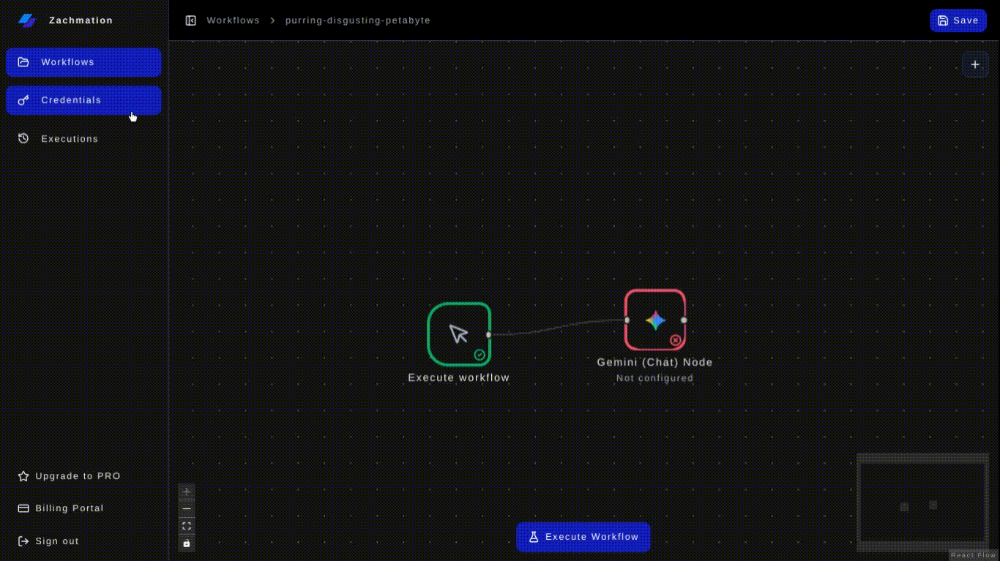

<div align="center">


# Zachmation

### Open-Source AI Workflow Automation Platform

Build powerful AI workflows visually using drag-and-drop nodes, AI models, triggers, APIs, and automations.

<p align="center">
  <a href="https://zachmation.vercel.app">Website</a>
  ·
  <a href="#">Documentation</a>
  ·
  <a href="https://github.com/19akshansh/zachmation/issues">Report Bug</a>
  ·
  <a href="https://github.com/19akshansh/zachmation/issues">Request Feature</a>
</p>

<p align="center">
  
  
  
  
</p>

<p align="center">
  
  
  
  
  
  
</p>

</div>

---

# 🚀 What is Zachmation?

Zachmation is a visual AI automation platform that allows users to build powerful workflows using drag-and-drop nodes.

Connect triggers, AI models, APIs, and integrations into automated pipelines without writing repetitive boilerplate code.

Whether you're creating AI content generators, internal automations, lead-processing systems, or agentic workflows, Zachmation provides the infrastructure to build and deploy them visually.

---

# 📸 Product Preview

## Workflow Builder


## Execution Logs



## Credentials Vault


## Billing Dashboard


---

# ✨ Features

## Visual Workflow Builder

- Drag-and-drop workflow editor
- Interactive node graph
- Real-time workflow editing
- Connection validation
- Node configuration panels

## AI-Powered Automation

- OpenAI, Google Gemini & Anthropic Claude chat nodes
- Tool-using Agent node with step-based reasoning
- Vector Store node for semantic memory / RAG
- AI image generation (Black Forest Labs)
- Multi-provider, credential-based architecture

## Workflow Triggers

- Manual Trigger
- Schedule / Cron Trigger (Pro)
- Google Forms Trigger
- Stripe Trigger (Pro)
- Webhook Trigger (Pro)
- Discord Trigger
- Telegram Trigger

## Execution Nodes

- **AI:** Gemini Chat, OpenAI Chat (Pro), Anthropic Chat (Pro), Black Labs Image Gen (Pro), Agent (Pro), Vector Store (Pro)
- **Logic & Data:** If / Switch, Loop, Merge, Filter, Edit Fields, List Shape, Date & Time, Code (sandboxed JS/Python), Wait / Delay
- **Integrations:** HTTP Request, Google Sheets, Postgres Query (Pro), Airtable, Notion, GitHub, Email / SMTP, Slack (Pro), Discord Send, Telegram Send, Zachurl, ZachCourse
- **Canvas:** Sticky Note

## Security & Credentials

- Encrypted credential storage
- OAuth authentication
- Provider-specific secrets management
- Secure workflow execution

## Monitoring

- Execution logs
- Workflow history
- Error tracking
- Node-level status visibility

## Authentication & Billing

- Better Auth
- Google OAuth
- GitHub OAuth
- Polar Billing Integration

---

# 🏗️ Architecture

```text
┌──────────────────────────┐
│    Triggers/Executions   │
└──────────────────────────┘
        │
        ▼
┌───────────────┐
│ Workflow Core │
└───────┬───────┘
        │
        ▼
┌─────────────────────────────┐
│ AI Providers + Credentials  │
└───────┬─b───────────────────┘
        │
        ▼
┌────────────────────────────────┐
│ Integrations + Execution Logs  │
└────────────────────────────────┘
```

---

# 🤖 Supported AI Providers

<div align="center">


&nbsp;&nbsp;&nbsp;

&nbsp;&nbsp;&nbsp;

&nbsp;&nbsp;&nbsp;


</div>

### Current Providers

| Provider          | Status | Notes                          |
| ----------------- | ------ | ------------------------------- |
| Gemini            | ✅     | Free tier, powers Agent & Vector Store |
| OpenAI            | ✅     | Pro                              |
| Claude (Anthropic)| ✅     | Pro                              |
| Black Forest Labs | ✅     | Image generation, Pro           |
| Hugging Face      | ✅     | Credential provider for image gen |

---

# 🔌 Integrations

<div align="center">


&nbsp;&nbsp;&nbsp;

&nbsp;&nbsp;&nbsp;

&nbsp;&nbsp;&nbsp;

&nbsp;&nbsp;&nbsp;

&nbsp;&nbsp;&nbsp;

&nbsp;&nbsp;&nbsp;

&nbsp;&nbsp;&nbsp;

&nbsp;&nbsp;&nbsp;

&nbsp;&nbsp;&nbsp;

&nbsp;&nbsp;&nbsp;

&nbsp;&nbsp;&nbsp;

&nbsp;&nbsp;&nbsp;


</div>

---

# 🧩 Available Nodes

## Triggers

| Node                 | Description                                                    | Pro |
| -------------------- | ---------------------------------------------------------------- | --- |
| Manual Trigger        | Runs the flow on clicking a button, good for a first run         |     |
| Schedule / Cron       | Runs the workflow on a recurring cron schedule                   | ✅  |
| Google Form Trigger   | Triggers on a Google Form submission                              |     |
| Stripe Event          | Triggers on a Stripe event                                        | ✅  |
| Webhook Trigger       | Triggers from any incoming webhook POST                           | ✅  |
| Discord Trigger       | Triggers from a Discord interaction or slash command               |     |
| Telegram Trigger      | Triggers when your Telegram bot receives an update                |     |

## AI

| Node               | Description                                                | Pro |
| ------------------- | -------------------------------------------------------------- | --- |
| Gemini Chat          | Makes a Gemini chat completion request                         |     |
| OpenAI Chat          | Makes an OpenAI chat completion request                        | ✅  |
| Anthropic Chat       | Makes a Claude (Anthropic) chat completion request              | ✅  |
| Black Labs Image Gen | Generates images via Black Forest Labs                          | ✅  |
| Agent                | Runs a tool-using Gemini agent with optional vector memory      | ✅  |
| Vector Store         | Stores and searches workflow memory using semantic embeddings   | ✅  |

## Logic & Data

| Node          | Description                                                  |
| -------------- | -------------------------------------------------------------- |
| If / Switch     | Routes execution through a conditional branch                  |
| Loop            | Runs a branch once for each item in an array                    |
| Merge           | Combines outputs from multiple branches                         |
| Filter          | Keeps only array items that match a condition                   |
| Edit Fields     | Adds or reshapes workflow context fields                        |
| List Shape      | Sorts, aggregates, or removes duplicate array items              |
| Date & Time     | Formats or shifts dates in a context array                       |
| Code            | Runs sandboxed JavaScript or Python against workflow context     |
| Wait / Delay    | Pauses the workflow for a duration or until a webhook resumes it |

## Integrations

| Node            | Description                                                | Pro |
| ---------------- | -------------------------------------------------------------- | --- |
| HTTP Request      | Makes an HTTP request                                           |     |
| Google Sheets     | Reads or appends spreadsheet rows                                |     |
| Postgres Query    | Runs a parameterized SELECT or INSERT query                     | ✅  |
| Airtable          | Lists, creates, updates, or deletes Airtable records              |     |
| Notion            | Queries databases and creates or updates Notion pages           |     |
| GitHub            | Creates, lists, comments on, or closes GitHub issues              |     |
| Email / SMTP      | Sends an email through an SMTP credential                       |     |
| Slack             | Sends a Slack message                                             | ✅  |
| Discord Send      | Sends a Discord message                                           |     |
| Telegram Send     | Sends a Telegram message                                          |     |
| Zachurl           | Creates a short URL with Zachurl                                  |     |
| ZachCourse        | Generates a personalized course with ZachCourse                  |     |

## Canvas

| Node         | Description                        |
| ------------- | ------------------------------------ |
| Sticky Note    | Adds a note to your workflow canvas |

---

# ⚡ Example Workflow

## AI Lead Qualification

```text
Google Form Submission
          │
          ▼
     Gemini AI
          │
          ▼
     HTTP Request
          │
          ▼
    Discord Alert
```

### Flow

1. User submits form
2. AI analyzes response
3. Lead data is sent to external API
4. Team receives notification

---

# 🛠️ Tech Stack

<table align="center">
<tr>
<th>Category</th>
<th>Technology</th>
</tr>

<tr>
<td><b>Frontend</b></td>
<td>

&nbsp;

&nbsp;

&nbsp;

&nbsp;

&nbsp;

</td>
</tr>

<tr>
<td><b>Backend</b></td>
<td>

&nbsp;

&nbsp;

&nbsp;

</td>
</tr>

<tr>
<td><b>Authentication</b></td>
<td>
<svg xmlns="http://www.w3.org/2000/svg"
width="32"
height="32"
fill="currentColor"
viewBox="0 0 24 24"
title="Better Auth">
<path d="M12.1 10.36H15.149999999999999V13.68H12.1z" />
<path d="m3,3v18h18V3H3Zm15.48,10.68v3h-6.38v-3h-3.48v3h-3.13V7.36h3.13v3h3.48v-3h6.38v6.32Z" />
</svg>
&nbsp;

&nbsp;

</td>
</tr>

<tr>
<td><b>Billing</b></td>
<td>

</td>
</tr>

<tr>
<td><b>Monitoring</b></td>
<td>

</td>
</tr>

</table>

---

# 🚀 Quick Start

## Clone Repository

```bash
git clone https://github.com/19akshansh/zachmation.git
cd zachmation
```

## Install Dependencies

```bash
npm install --legacy-peer-deps
```

## Configure Environment Variables

Create a `.env` file and view `/.env.example` for reference.

## Generate Prisma Client

```bash
npx prisma generate
```

## Run Migrations

```bash
npx prisma migrate deploy
```

## Start Development Server

```bash
npm run dev:all
```

---

# 📂 Project Structure

```text
src
├── app
├── components
├── features
│   ├── editor
│   ├── credentials
│   ├── workflows
│   └── nodes
├── inngest
├── lib
├── server
└── trpc
```

---

# 🗺️ Roadmap

## Shipped

- [x] Webhook Trigger
- [x] Conditional Logic (If / Switch)
- [x] Delay / Wait Nodes
- [x] Loop, Merge, Filter, List Shape, Date & Time, Code nodes
- [x] Agent Nodes (tool-using Gemini agent)
- [x] Vector Store (semantic memory)
- [x] Cron / Schedule Trigger
- [x] Telegram & Discord Triggers and Send nodes
- [x] Google Sheets, Postgres, Airtable, Notion, GitHub integrations

## Near Term

- [ ] Workflow Templates
- [ ] API Workflow Execution

## Future

- [ ] Workflow Marketplace
- [ ] Team Workspaces
- [ ] Public APIs
- [ ] Community Templates

---

# 🤝 Contributing

Contributions are welcome.

1. Fork the repository
2. Create a new branch
3. Make your changes
4. Open a Pull Request

---

# ⭐ Star History

[](https://star-history.com)

---

# 📜 License

Licensed under the MIT License.

---

<div align="center">

### Built with ❤️ using Next.js, Prisma, Inngest, and AI

If Zachmation helps you, consider giving the repository a ⭐

</div>
