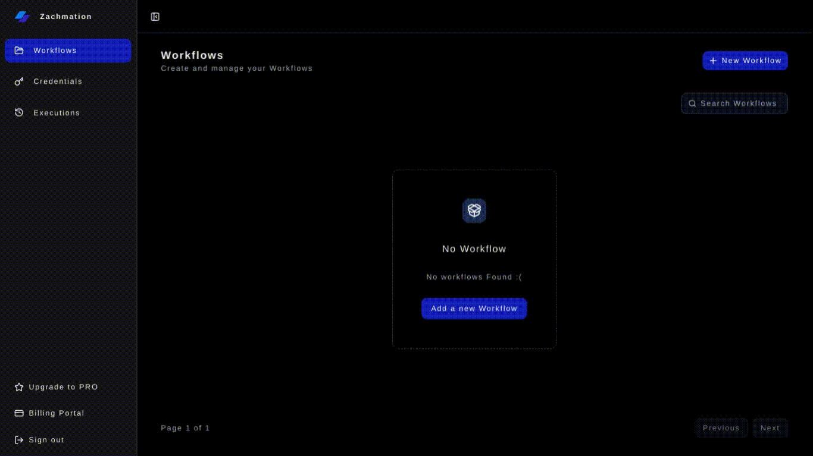
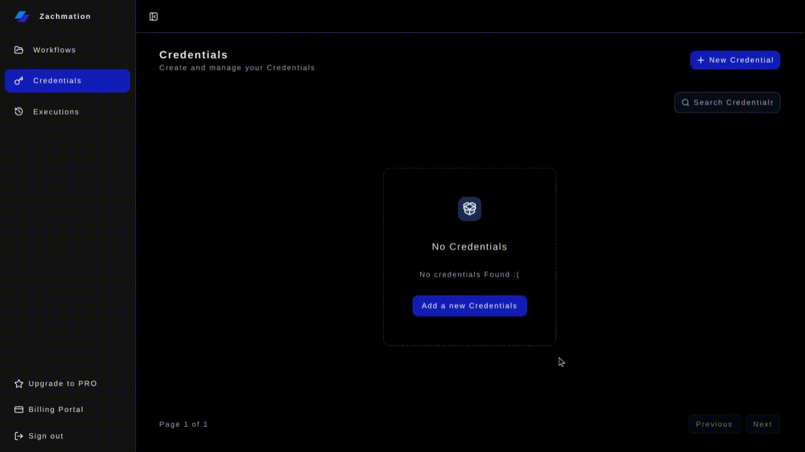
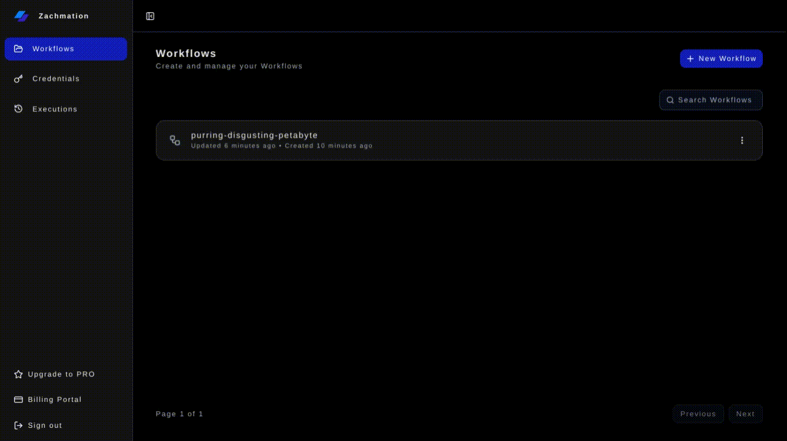

<div align="center">


# Zachmation

### Open-Source AI Workflow Automation Platform

Build powerful AI workflows visually using drag-and-drop nodes, AI models, triggers, APIs, and automations.

<p align="center">
  <a href="https://zachmation.com">Website</a>
  ·
  <a href="#">Documentation</a>
  ·
  <a href="https://github.com/19akshansh/zachmation/issues">Report Bug</a>
  ·
  <a href="https://github.com/19akshansh/zachmation/issues">Request Feature</a>
</p>

<p align="center">
  
  
  
  
</p>

<p align="center">
  
  
  
  
  
  
</p>

</div>

---

# 🚀 What is Zachmation?

Zachmation is a visual AI automation platform that allows users to build powerful workflows using drag-and-drop nodes.

Connect triggers, AI models, APIs, and integrations into automated pipelines without writing repetitive boilerplate code.

Whether you're creating AI content generators, internal automations, lead-processing systems, or agentic workflows, Zachmation provides the infrastructure to build and deploy them visually.

---

# 📸 Product Preview

## Workflow Builder



## Execution Logs


## Credentials Vault



## Billing Dashboard



---

# ✨ Features

## Visual Workflow Builder

* Drag-and-drop workflow editor
* Interactive node graph
* Real-time workflow editing
* Connection validation
* Node configuration panels

## AI-Powered Automation

* OpenAI Integration
* Google Gemini Integration
* Anthropic Claude Integration
* AI Image Generation
* Multi-provider architecture

## Workflow Triggers

* Manual Trigger
* Google Forms Trigger
* Stripe Trigger

## Execution Nodes

* AI Text Generation
* AI Image Generation
* HTTP Requests
* Discord Messages
* Slack Messages

## Security & Credentials

* Encrypted credential storage
* OAuth authentication
* Provider-specific secrets management
* Secure workflow execution

## Monitoring

* Execution logs
* Workflow history
* Error tracking
* Node-level status visibility

## Authentication & Billing

* Better Auth
* Google OAuth
* GitHub OAuth
* Polar Billing Integration

---

# 🏗️ Architecture

```text
┌──────────────────────────┐
│    Triggers/Executions   │
└──────────────────────────┘
        │
        ▼
┌───────────────┐
│ Workflow Core │
└───────┬───────┘
        │
        ▼
┌─────────────────────────────┐
│ AI Providers + Credentials  │
└───────┬─b───────────────────┘
        │
        ▼
┌────────────────────────────────┐
│ Integrations + Execution Logs  │
└────────────────────────────────┘
```

---

# 🤖 Supported AI Providers

<div align="center">


&nbsp;&nbsp;&nbsp;

&nbsp;&nbsp;&nbsp;

&nbsp;&nbsp;&nbsp;


</div>

### Current Providers

| Provider          | Status |
| ----------------- | ------ |
| OpenAI            | ✅      |
| Gemini            | ✅      |
| Claude            | ✅      |
| Black Forest Labs | ✅      |
| Hugging Face      | 🚧     |

---

# 🔌 Integrations

<div align="center">


&nbsp;&nbsp;&nbsp;

&nbsp;&nbsp;&nbsp;

&nbsp;&nbsp;&nbsp;


</div>

---

# 🧩 Available Nodes

| Category      | Nodes                                    |
| ------------- | ---------------------------------------- |
| Triggers      | Manual Trigger, Google Forms, Stripe     |
| AI            | OpenAI, Gemini, Claude, Image Generation |
| Communication | Slack, Discord                           |
| Utility       | HTTP Request                             |
| Logic         | Coming Soon                         |

---

# ⚡ Example Workflow

## AI Lead Qualification

```text
Google Form Submission
          │
          ▼
     Gemini AI
          │
          ▼
     HTTP Request
          │
          ▼
    Discord Alert
```

### Flow

1. User submits form
2. AI analyzes response
3. Lead data is sent to external API
4. Team receives notification

---

# 🛠️ Tech Stack

<table align="center">
<tr>
<th>Category</th>
<th>Technology</th>
</tr>

<tr>
<td><b>Frontend</b></td>
<td>

&nbsp;

&nbsp;

&nbsp;

&nbsp;

&nbsp;

</td>
</tr>

<tr>
<td><b>Backend</b></td>
<td>

&nbsp;

&nbsp;

&nbsp;

</td>
</tr>

<tr>
<td><b>Authentication</b></td>
<td>
<svg xmlns="http://www.w3.org/2000/svg"
width="32"
height="32"
fill="currentColor"
viewBox="0 0 24 24"
title="Better Auth">
<path d="M12.1 10.36H15.149999999999999V13.68H12.1z" />
<path d="m3,3v18h18V3H3Zm15.48,10.68v3h-6.38v-3h-3.48v3h-3.13V7.36h3.13v3h3.48v-3h6.38v6.32Z" />
</svg>
&nbsp;

&nbsp;

</td>
</tr>

<tr>
<td><b>Billing</b></td>
<td>

</td>
</tr>

<tr>
<td><b>Monitoring</b></td>
<td>

</td>
</tr>

</table>

---

# 🚀 Quick Start

## Clone Repository

```bash
git clone https://github.com/19akshansh/zachmation.git
cd zachmation
```

## Install Dependencies

```bash
npm install --legacy-peer-deps
```

## Configure Environment Variables

Create a `.env` file and view `/.env.example` for reference.


## Generate Prisma Client

```bash
npx prisma generate
```

## Run Migrations

```bash
npx prisma migrate deploy
```

## Start Development Server

```bash
npm run dev:all
```

---

# 📂 Project Structure

```text
src
├── app
├── components
├── features
│   ├── editor
│   ├── credentials
│   ├── workflows
│   └── nodes
├── inngest
├── lib
├── server
└── trpc
```

---

# 🗺️ Roadmap

## Near Term

* [ ] Workflow Templates
* [ ] API Workflow Execution
* [ ] Webhook Trigger
* [ ] Conditional Logic
* [ ] Delay / Wait Nodes

## Future

* [ ] Agent Nodes
* [ ] Workflow Marketplace
* [ ] Team Workspaces
* [ ] Public APIs
* [ ] Community Templates

---

# 🤝 Contributing

Contributions are welcome.

1. Fork the repository
2. Create a new branch
3. Make your changes
4. Open a Pull Request

---

# ⭐ Star History

[](https://star-history.com)


---

# 📜 License

Licensed under the MIT License.

---

<div align="center">

### Built with ❤️ using Next.js, Prisma, Inngest, and AI

If Zachmation helps you, consider giving the repository a ⭐

</div>
